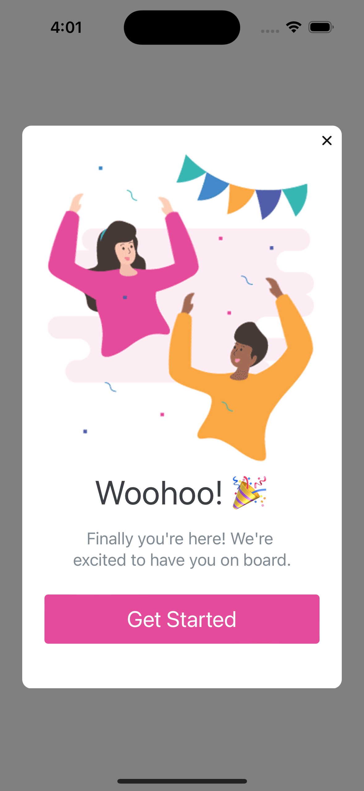
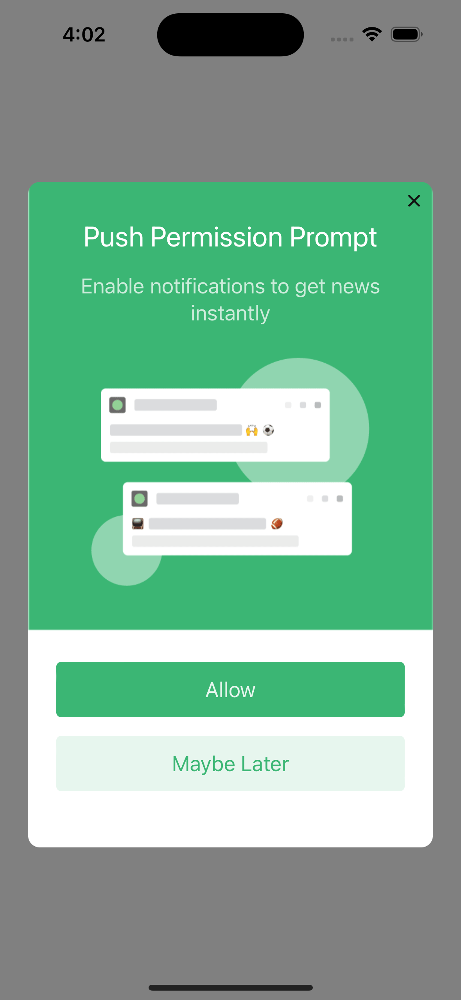
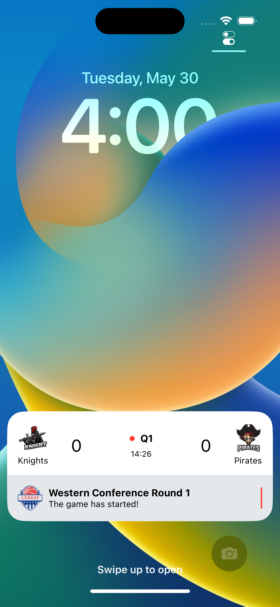

  <a href="https://documentation.onesignal.com/docs/onboarding-with-onesignal" target="_blank">Quickstart</a>
  &nbsp;&nbsp;•&nbsp;&nbsp;
  <a href="https://onesignal.com/" target="_blank">Website</a>
  &nbsp;&nbsp;•&nbsp;&nbsp;
  <a href="https://documentation.onesignal.com/docs" target="_blank">Docs</a>
  &nbsp;&nbsp;•&nbsp;&nbsp;
  <a href="https://github.com/OneSignalDevelopers" target="_blank">Examples</a>
   
  

# OneSignal iOS Sample

OneSignal makes engaging customers simple and is the fastest, most reliable service to send push notifications, in-app messages, SMS, and emails.

This project demonstrates how to integrate OneSignal into an iOS app built with SwiftUI to handle your messaging needs, including push notifications, SMS text messages, email, and in-app messaging. Feel free to use this sample as a reference for your own iOS integration.

#### In-app Message App Launch

Configure in-app messages to present to users on app launch.

#### In-app Message Push Permission Prompt

#### Live Activity Sporting Event

## 🚦 Getting started

Todo

## ❤️ Developer Community

For additional resources, please join the [OneSignal Developer Community](https://onesignal.com/onesignal-developers).

Get in touch with us or learn more about OneSignal through the channels below.

- [Follow us on Twitter](https://twitter.com/onesignaldevs) to never miss any updates from the OneSignal team, ecosystem & community
- [Join us on Discord](https://discord.gg/EP7gf6Uz7G) to be a part of the OneSignal Developers community, showcase your work and connect with other OneSignal developers
- [Read the OneSignal Blog](https://onesignal.com/blog/) for the latest announcements, tutorials, in-depth articles & more.
- [Subscribe to us on YouTube](https://www.youtube.com/channel/UCe63d5EDQsSkOov-bIE_8Aw/featured) for walkthroughs, courses, talks, workshops & more.
- [Follow us on Twitch](https://www.twitch.tv/onesignaldevelopers) for live streams, office hours, support & more.

## Show your support

Give a ⭐️ if this project helped you, and watch this repo to stay up to date.
